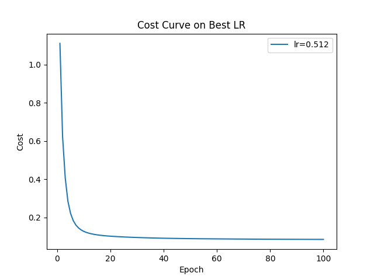
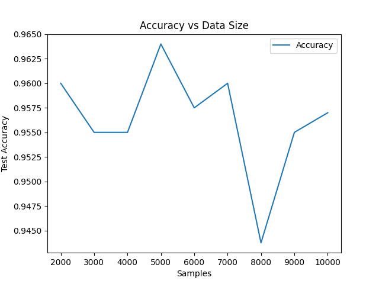
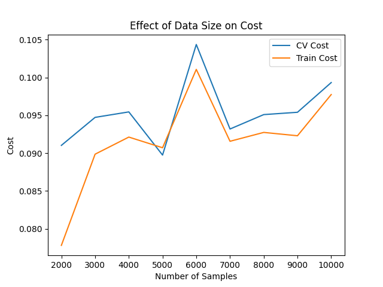
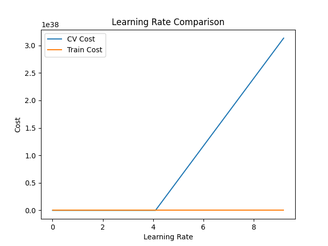

:::writing
# Neural Network From Scratch (NumPy)

A fully connected feedforward neural network implemented entirely from scratch using NumPy.  
This project focuses on understanding the internal mechanics of neural networks without relying on high‑level deep learning frameworks such as TensorFlow or PyTorch.

The goal is to explore how neural networks work at a fundamental level, including how gradients are computed, how parameters are updated, and how model performance can be evaluated and improved.

---

## Project Overview

The model is trained on a synthetic nonlinear dataset generated from the following function:

z = sin(x) + cos(y)

This produces a nonlinear decision boundary, making the classification problem more challenging and allowing the neural network to learn more complex patterns.

The project experiments with different training configurations, initialization strategies, and evaluation techniques.

---

## Features

- Feedforward Neural Network implemented from scratch with NumPy
- Forward propagation
- Backpropagation
- Multiple activation functions:
  - Sigmoid
  - ReLU
- Weight initialization strategies:
  - Xavier Initialization
  - He Initialization
- Gradient checking to verify backpropagation implementation
- K-Fold Cross Validation
- Learning rate comparison
- Training and evaluation visualizations
- Final evaluation on unseen test data

---

## Cross Validation

To obtain a more reliable estimate of model performance, the project uses K-Fold Cross Validation.

Instead of splitting the dataset only once, the data is divided into multiple folds. The model is trained multiple times, each time using a different fold as the validation set while the remaining folds are used for training.

The final performance is computed as the average across all folds, which provides a better estimate of how well the model generalizes to unseen data.

---

## Installation

Clone the repository:

git clone https://github.com/SiminFahimi/neural-network-from-scratch.git
cd neural-network-from-scratch

Install the required dependencies:

pip install -r requirements.txt

---

## Usage

Run the main experiment:

python main.py

The script will:

- Generate a synthetic dataset
- Train the neural network
- Perform cross-validation
- Evaluate model performance
- Produce visualizations of the results

---

## Project Structure

neural-network/
│
├── main.py              # Main experiment pipeline
├── model.py             # Neural network implementation
├── train.py             # Training logic and cross-validation
├── eval.py              # Model evaluation utilities
├── generate_data.py     # Synthetic dataset generation
├── plots.py             # Visualization utilities
├── utils.py             # Helper functions
├── requirements.txt     # Project dependencies
└── README.md

---

## Future Work

This project is still under development. Planned improvements include:

- Feature engineering to help the model capture more informative patterns
- Improved preprocessing and data handling
- Support for deeper network architectures
- Additional activation functions
- More advanced visualization tools
- Experiments with more complex nonlinear functions

---

## Purpose

The main objective of this project is educational:  
to develop a deeper understanding of how neural networks work internally and how design choices such as activation functions, weight initialization, learning rate, and cross-validation influence model performance.

## Results

### Training Loss

### Effect of size

### Learning rates comparison

### 3D Predictions
