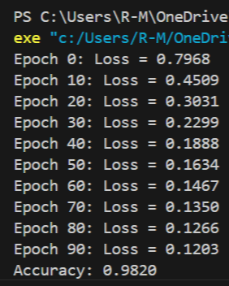
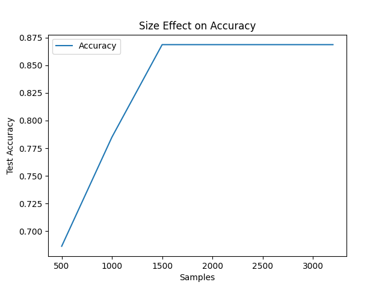
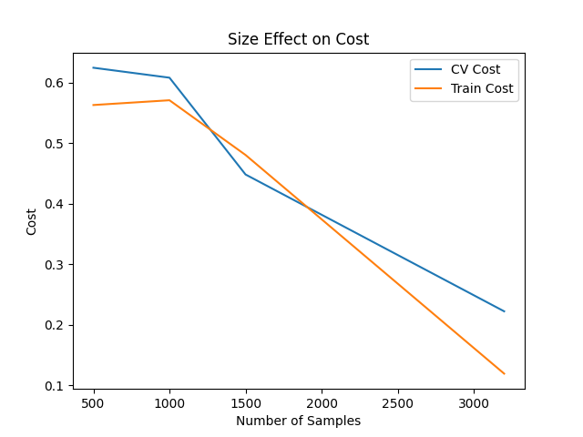
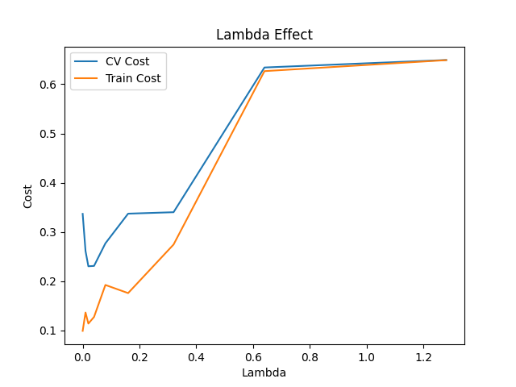
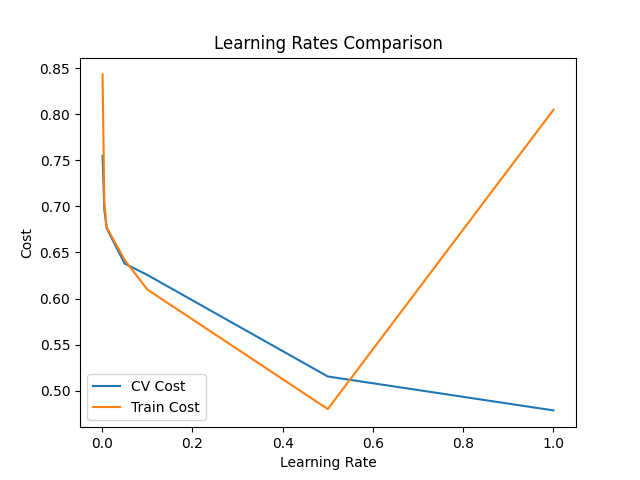
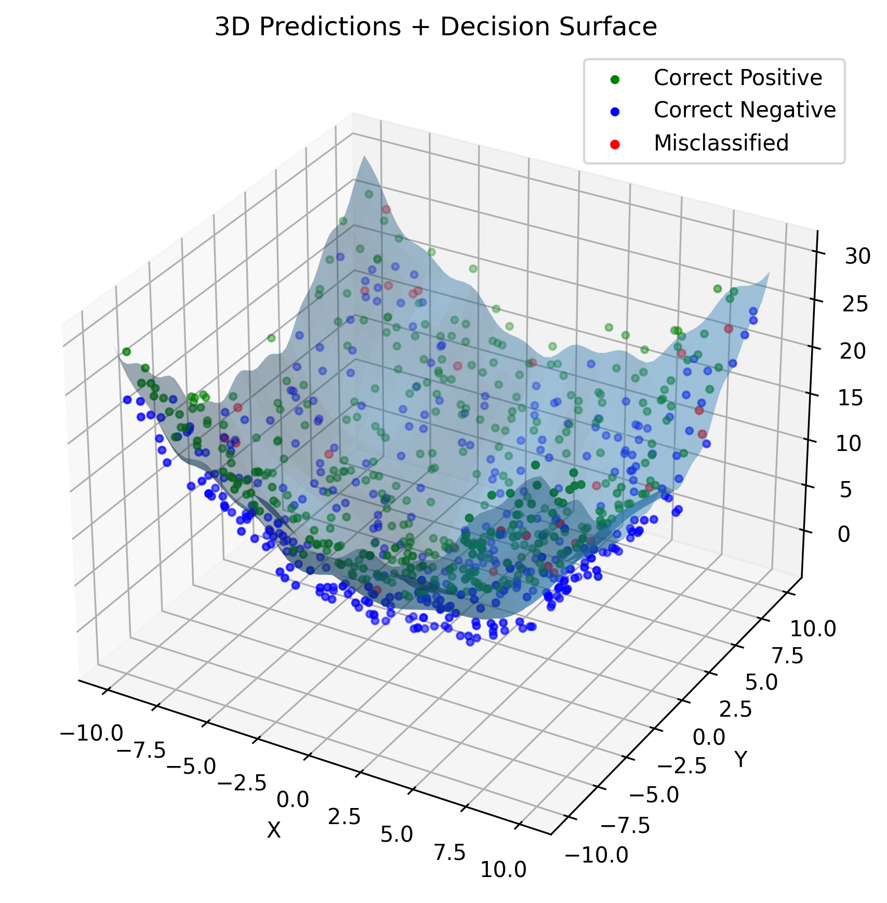

# Neural Network from Scratch (NumPy)

A fully connected feedforward neural network implemented entirely with **Python + NumPy**, without using deep learning frameworks such as PyTorch or TensorFlow.

This project was developed to understand the internal mechanics of neural networks by manually implementing forward propagation, backpropagation, optimization, regularization, and model evaluation from first principles.

---

## Highlights

- Neural network implemented entirely from scratch
- Forward propagation
- Backpropagation
- Mini-batch gradient descent
- Binary cross-entropy loss
- L2 regularization
- He / Xavier weight initialization
- Gradient checking via finite differences
- K-fold cross-validation
- Hyperparameter tuning experiments
- Visualization of training behavior and decision boundaries

---

## Model Architecture

Example network:

Input Layer  
→ Hidden Layer (ReLU)  
→ Hidden Layer (ReLU)  
→ Output Layer (Sigmoid)

The implementation supports configurable:

- Number of layers
- Hidden units
- Activation functions
- Learning rate
- Regularization strength
- Batch size

---

## Dataset Generation

A synthetic 3D binary classification dataset was constructed to create a nonlinear and controllable decision boundary.

First, two input variables were sampled uniformly:

- x ~ Uniform(-10, 10)
- y ~ Uniform(-10, 10)

A nonlinear surface was then defined using a custom function:

z = f(x, y)

To generate class separation, each sample was assigned a binary label:

- Class 1: points above the surface  
- Class 0: points below the surface  

This was implemented by introducing a random vertical offset around the surface:

z = f(x, y) + offset   if label = 1  
z = f(x, y) - offset   if label = 0

where:

- offset ~ Uniform(1.0, 3.0)

Finally, each data point is represented as:

X = [x, y, z]

This construction ensures a **non-linearly separable 3D classification problem**, requiring the model to learn complex decision boundaries rather than simple linear separation.
---
## Gradient Checking

To verify the correctness of the backpropagation implementation, numerical gradient checking was performed using finite differences:

$$
\frac{\partial J}{\partial \theta}
\approx
\frac{J(\theta+\epsilon)-J(\theta-\epsilon)}{2\epsilon}
$$

The analytical gradients from backpropagation were compared against numerical estimates, confirming implementation correctness within a small tolerance.
---

## Feature Engineering

To enhance non-linear representation, the following features were engineered:
- x²
- y²
- sin(x)
- cos(y)
These produced small but consistent performance gains.
---

## Results

### Raw vs Engineered Features

| Input Type          | Accuracy |
|--------------------|----------|
| Raw Features       | 0.9587   |
| Engineered Features| 0.9663   |

The performance gain was small but consistent.

## Training Curve

...

## Effect of size

...


...

## Lambda comparison

...

## Learning rate comparison

...

## 3D Predictions


---

## Experiments Conducted

- Hyperparameter tuning  
- Learning rate comparison  
- L2 regularization analysis  
- Dataset size impact  
- Learning curves  
- 3D decision boundary visualization  

---

## Project Structure
```
.
├── model.py # Neural network implementation
├── train.py # Training pipeline
├── evaluate.py # Model evaluation
├── plots.py # Visualization utilities
├── data.py # Synthetic dataset generation
├── results/
│ ├── loss.png
│ ├── lr_effect.png
│ ├── lambda_effect.png
│ ├── size_effect_on_accuracy.png
│ ├── size_effect_on_cost.png
│ ├── prediction_3d.png
└── README.md
```
---

## Implementation Notes

- Implemented using NumPy only
- No external machine learning libraries used
- Focused on correctness, clarity, and learning fundamentals

---

## Possible Extensions

- Adam optimizer
- RMSProp optimizer
- Deeper neural networks
- Multi-class classification
- PyTorch reimplementation for benchmarking
- Automated feature selection

---

## Summary

This project demonstrates both mathematical understanding and engineering ability by implementing a neural network system entirely from scratch using NumPy, including optimization, regularization, verification, and structured experimentation.
