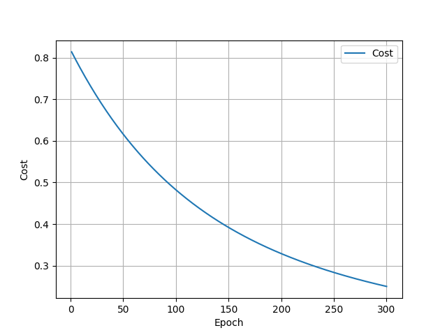
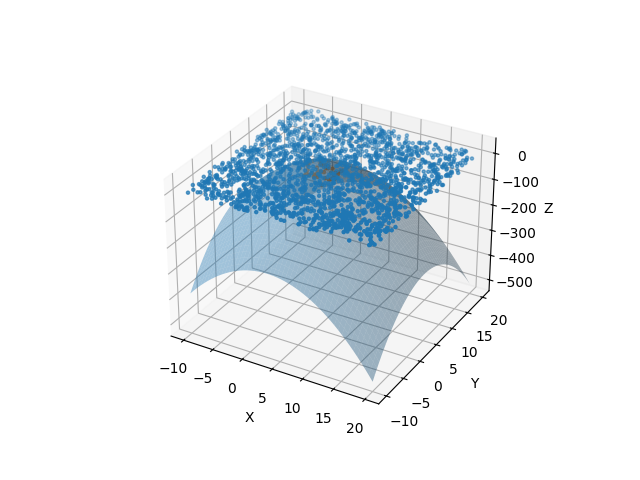

# Neural Network from Scratch (NumPy)

This project implements a fully connected feedforward neural network from scratch using only NumPy.  
The goal is to understand the mathematical foundations of neural networks, including forward propagation, backpropagation, gradient descent, and gradient checking—without using deep learning frameworks such as TensorFlow or PyTorch.

---

## Overview

The model is trained on a synthetic 3D classification problem where the decision boundary is a nonlinear quadratic surface:

\[
z > -(x - 3)^2 - (y - 5)^2 + 8
\]

The network learns to classify points in 3D space as 0 or 1.

---

## Features

- Fully connected feedforward neural network
- Manual implementation of forward propagation
- Backpropagation from scratch
- Sigmoid activation function
- L2 regularization
- Gradient descent optimization
- Numerical gradient checking for correctness
- Synthetic dataset generation
- 3D visualization of predictions and decision boundary
- Training loss tracking

---

## Project Structure

```
.
├── main.py # Training, evaluation, and visualization
├── model.py # Neural network implementation
├── generate_data.py # Synthetic dataset generation
├── requirements.txt # Dependencies
└── README.md
```

---

## Model Architecture

- Input layer: 3 features (x, y, z)
- Hidden layers: configurable (default: 3 hidden layers with 10 neurons each)
- Output layer: 1 neuron (binary classification)
- Activation function: Sigmoid

---

## How It Works

### 1. Forward Propagation
Each layer computes:
\[
z = W \cdot x + b,\quad a = \sigma(z)
\]

Bias is handled by explicitly adding a column of ones.

---

### 2. Backpropagation
Gradients are computed manually using the chain rule, propagating errors from output layer to input layer.

---

### 3. Gradient Checking
Numerical gradient approximation is used to verify correctness of backpropagation implementation.

---

### 4. Optimization
Parameters are updated using gradient descent:

\[
\theta := \theta - \alpha \nabla J(\theta)
\]

---

## Results

- The model successfully learns a nonlinear decision boundary.
- Training loss decreases over time.
- Gradient checking confirms correctness of backpropagation.
- 3D visualization shows classification performance.

---

## How to Run

### 1. Install dependencies
```bash
pip install numpy matplotlib
2. Run training
python main.py
Output Visualizations
Training loss curve
3D prediction visualization (correct vs incorrect points)
True decision boundary surface
Key Learning Outcome

This project demonstrates a deep understanding of:

Neural network fundamentals
Vectorized numerical computation
Optimization techniques
Model verification through gradient checking
Future Improvements
Mini-batch gradient descent
ReLU activation function support
Softmax multi-class extension
Regularization tuning and experiments
```

## Results

### Training Loss


### 3D Predictions

